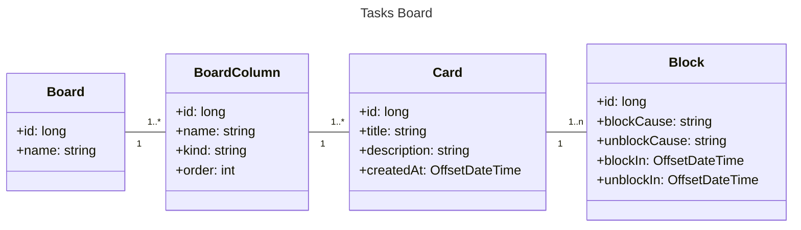

# 📝 Board Tasks

Projeto DIO Board de tarefas desenvolvido com **Spring Boot**, **Java 21** e **Maven**.  
(Obs: Projeto original feito com gradle.)

---

## 🚀 Tecnologias utilizadas
- Java 21
- Spring Boot
- Maven
- Spring Data JPA
- **Liquibase** (controle de versão do banco de dados)
- **Lombok** (redução de boilerplate code)
- **Spring Boot Starter Test** (testes unitários e de integração)

---

## 🚀 Dependencies
```
<!-- Liquibase -->
<dependency>
    <groupId>org.liquibase</groupId>
    <artifactId>liquibase-core</artifactId>
</dependency>

<!-- Lombok -->
<dependency>
    <groupId>org.projectlombok</groupId>
    <artifactId>lombok</artifactId>
    <scope>provided</scope>
</dependency>

<!-- Test -->
<dependency>
    <groupId>org.springframework.boot</groupId>
    <artifactId>spring-boot-starter-test</artifactId>
    <scope>test</scope>
</dependency>
```




